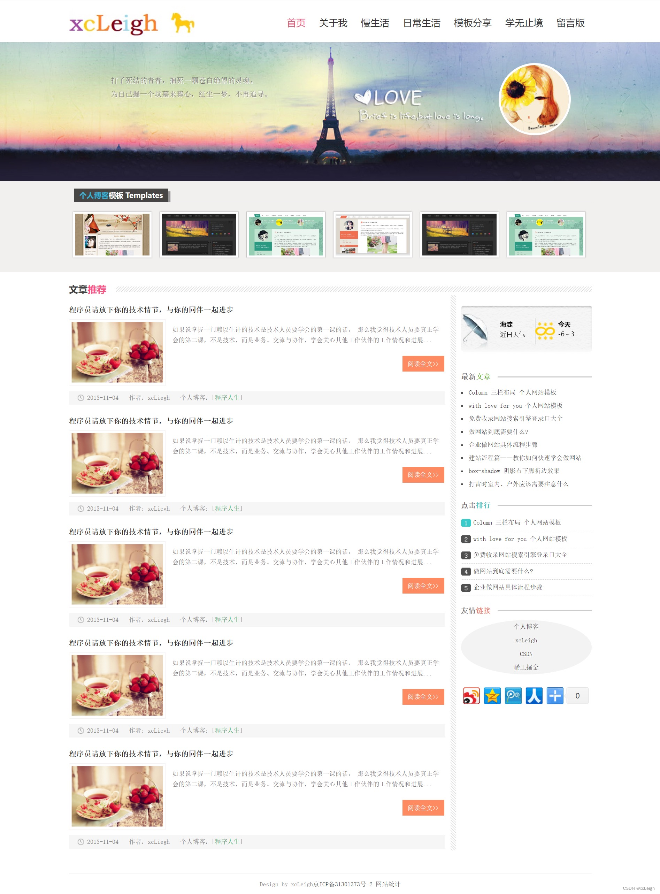
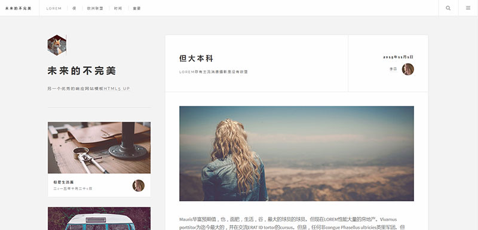
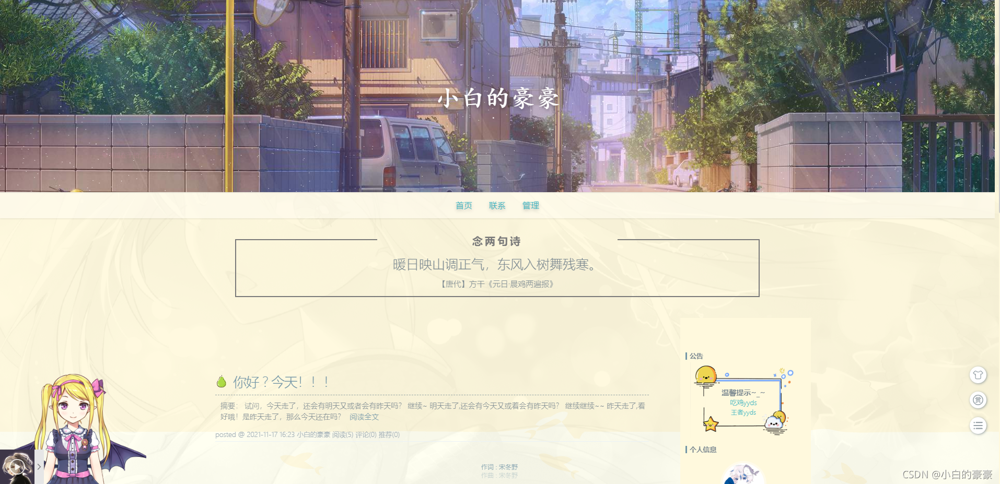
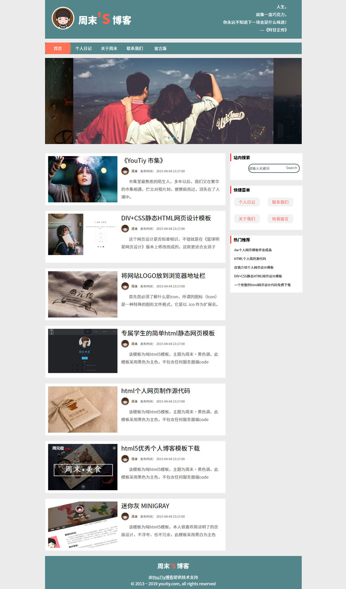

# 个人博客设计

###网页参考:

 https://sorrymaker11.github.io/ 个人博客

https://www.csdn.net/?spm=1001.2101.3001.4476  CSDN首页

https://juejin.cn/  掘金首页

###参考图片:

###文章展示逻辑

首页 

​	分页展示所有文章

​	文章上展示点赞/浏览量/作者/标签

文章

​	分页展示所有作者自己的文章

修改用户信息    //待做

​	提交的时候需要做判断  是否有进行修改  如果没有  不应该发送请求

